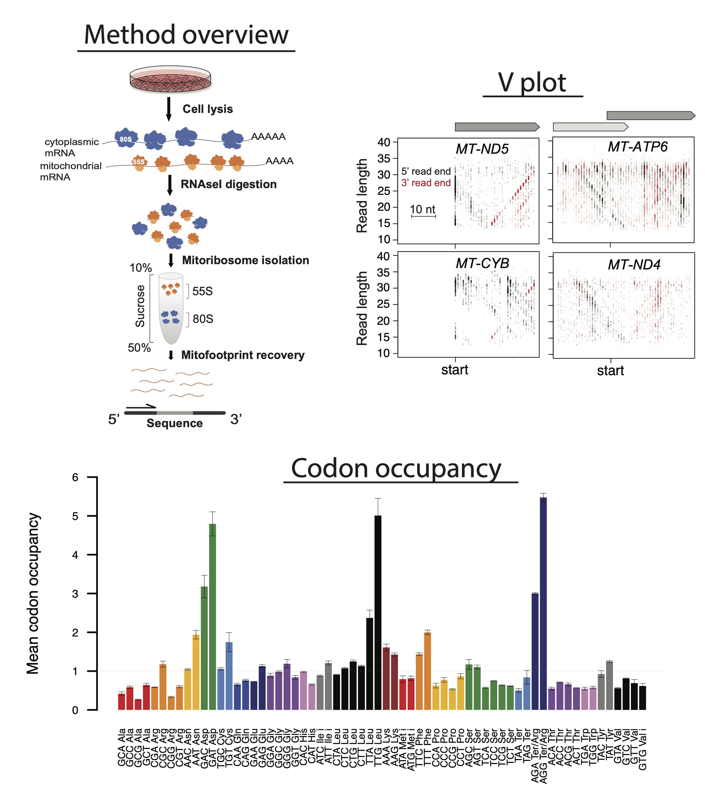

# Human mitoribosome profiling analysis

This repository includes the scripts and annotation files needed to analyze mitoribosome profiling data generated from human cells with or without mouse spike-in. The directories are listed in order to take raw fastq files through trimming, alignment, quality control, and many other library characteristics. There are README files for each analysis step explaining how scripts are run and what is generated with each. Optimized to run on HMS O2 computing cluster (SLURM job scheduler).  

Scripts are also provided to align and count reads on features for matching cytoribosome profiling data and RNAseq data (see _CytoRP and _RNAseq directories), and to plot OXPHOS complex averages for both synthesis and RNA levels of Cyto vs. Mito OXPHOS complexes.

# Analysis steps

0. Create STAR indexes
1. Trim and align raw reads, remove PCR duplicates (repeat for CytoRP and RNAseq data if available)  >  get library compositions, RPF length distributions, bedgraphs for viewing on IGV
2. Make bed files for Vplots  >  5' and 3' plus(P) and minus(M) files for input to Lengths_vs_Pos_Vplot.R to visualize read lengths along genes
3. Calculate periodicity on 5' and 3' ends PER RPF LENGTH  >  Needed for accurately determining A-site transformation, in combination with RPF length distibutions (step 1) and Vplots: RPFlength vs. genomic position (step 2)
4. A-site transformation  >  get periodicity and coverage, A-site bedgraphs for viewing on IGV
5. Count reads on features using featureCounts (repeat for CytoRP and RNAseq data if available) >  get unique- and multi- (all-) aligned readcounts across genes. Use in AddGeneName_RPK.R to get RPK values
6. Get codon occupancy
7. Make stoichiometry plots (for experiments with MitoRP, CytoRP, and RNAseq data)

# Data availability and manuscript

Fastq files are deposited in the GEO database under the accession number GSE173283. The link to our full manuscript will be provided here upon publication.





To install:  
Download zipped repository and unzip into directory with *fastq.gz files.  
Run all code blocks in steps 1-6 from this top directory.  
Intermediate as well as many other useful files will output to subdirectories.  
Final results and plots will output to working directory.  
logs/ contains all logs, including error logs

Required R packages: data.table, pheatmap, inlmisc, RColorBrewer, stringr, scales, Rsubread, rlist, Rfast, plotrix  
To install packages:
```bash
# Enter interactive node on O2
srun -p interactive --pty --mem=10G -t 0-02:00 /bin/bash
# Load R module
module load R/4.0.1
# Begin R session on command line
R
```
```
install.packages(c('data.table', 'pheatmap', 'inlmisc', 'RColorBrewer', 'stringr', 'scales', 'Rsubread', 'rlist', 'Rfast')
quit()
exit
```


## 0_CreateSTARindex
Download fasta and gtf files from desired source (e.g. GENCODE) and follow instuctions.txt  
Note for aligning CytoRP and RNAseq data a new index should be made, leaving out the mouse genome if there are not mouse spike-ins in those libraries  
 

## 1_AlignData  
Initial alignment and quality control  
Follow steps in ./1_AlignData/README.md  

## 2_MakeLengthBeds  
Optional step to make Vplots. Depends on output from 1_AlignData  
Follow steps in ./2_MakeLengthBeds/README.md  

## 3_CountFramePerLength
Optional step to observe periodicity for each RPF size. Depends on output from 1_AlignData  
Follow steps in ./3_CountFramePerLength/README.md  

## 4_AsiteTransformation
Transforms data to A site and produces A site bedGraphs based on given RPF size range and offsets. Also calculates codon coverage and periodicity for provided RPF sizes. Depends on output from 1_AlignData and you should use information from 2_MakeLengthBeds and 3_CountFramePerLength to decide on size range and offsets.
Follow steps in ./4_AsiteTransformation/README.md  

## 5_CountReadsOnFeatures
Get read counts on genes using featureCounts from Rsubread R package. Script and annotations are included to convert gene IDs to gene names and calculate RPK.  
Follow steps in ./5\_CountReadsOnFeatures/README.md

## 6_CodonOccupancy
Get codon occupancy and make bar plots of mean occupancy, box plots of individual codon occupancy, and scatter plots of codon occupancy vs tRNA abundance. Follow steps in ./6_CodonOccupancy/README.md                                                                                                        
