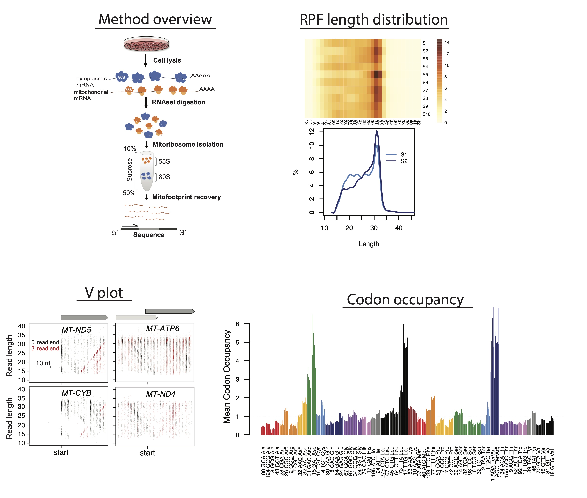

# Human mitoribosome profiling analysis

This repository includes the scripts and annotation files needed to analyze mitoribosome profiling data generated from human cells with or without mouse spike-in. The directories are listed in order to take raw fastq files through trimming, alignment, quality control, and many other library characteristics. There are README files for each analysis step explaining how scripts are run and what is generated with each. Optimized to run on HMS O2 computing cluster (SLURM job scheduler).

# Analysis steps

0. Create STAR index
1. Trim and align raw reads, remove PCR duplicates  >  get library compositions, RPF length distributions, 5' bedgraphs for viewing on IGV
2. Make bed files for Vplots  >  5' and 3' plus(P) and minus(M) files for input to Lengths_vs_Pos_Vplot.R to visualize read lengths along genes
3. Calculate periodicity on 5' and 3' ends PER RPF LENGTH  >  Needed for accurately determining A-site transformation, in combination with RPF length distibutions (step 1) and Vplots: RPFlength vs. genomic position (step 2)
4. A-site transformation  >  get periodicity and coverage, A-site bedgraphs for viewing on IGV
5. Count reads on features using featureCounts  >  get unique- and multi- (all-) aligned readcounts across genes. Use in featureCounts_addGeneName_RPK.R to get RPK values
6. Get codon occupancy

# Data availability and manuscript

Fastq files are deposited in the GEO database under the accession number GSE173283. The link to our full manuscript will be provided here upon publication.

## 0_CreateSTARindex
Download fasta and gtf files from desired source (e.g. GENCODE) and follow instuctions.txt

## 1_AlignData  
Initial alignment and quality control  
Follow steps in ./1_AlignData/README.md  

## 2_MakeLengthBeds  
Optional step to make Vplots. Depends on output from 1_AlignData  
Follow steps in ./2_MakeLengthBeds/README.md  

## 3_CountFramePerLength
Optional step to observe periodicity for each RPF size. Depends on output from 1_AlignData  
Follow steps in ./3_CountFramePerLength/README.md  

## 4_AsiteTransformation
Transforms data to A site and produces A site bedGraphs based on given RPF size range and offsets. Also calculates codon coverage and periodicity for provided RPF sizes. Depends on output from 1_AlignData and you should use information from 2_MakeLengthBeds and 3_CountFramePerLength to decide on size range and offsets.
Follow steps in ./4_AsiteTransformation/README.md  

   
## 5. run_featureCounts_hMitoRP.sh LibName offset

### 6. CodonOccupancy.sh LibName sizeRange
To get codon occupancy, move Asite bedGraphs (${LibName}_Mito_mRNA.noDups.Asite_30to33_P/M.bedGraph) to personal computer, make new directory 'CodonFrequency' and run                                                                                                         
